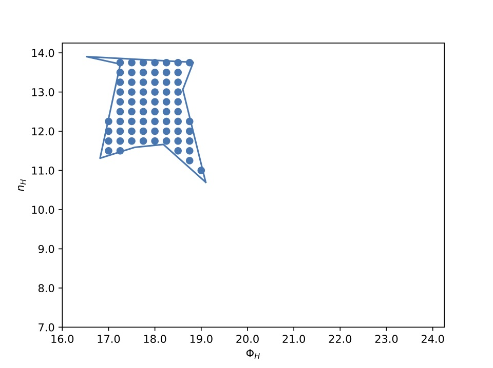

===============
Nebulous
===============

What is Nebulous
=====================

**Nebulous** is a reversible jump Markov Chain Monte Carlo that takes Cloudy (Ferland et al, 2013) outputs and fits line ratios to find the optimal :math:`\Phi` and :math:`n_H` parameter space the broad line region occupies under a similar assumption of the Locally Optimally Emitting Cloud (LOC) model (Baldwin et al., 1995). Cloudy is a well-established and extensive spectral synthesis code designed to simulate realistic physical condition inside gas clouds. It predicts the thermal, photoionisation, and chemical structure of a non-equilibrium cloud illuminated by an external source of radiation and predicts its resulting spectrum.

The programs first calculates line EW values (with respect to continuum flux at 1215 Å) given a line intensity grid from Cloudy and :math:`\Phi` and :math:`n_H` parameter space, described by a shape (that is fit using the reversible jump MCMC). Then uses these EW values to create line ratios. The shape can have :math:`n>3` vertices and occupy any region in the allowed parameter space (example shown in Figure 1).The RJMCMC fit boths the number of vertices, the position of the vertices in :math:`\Phi` and :math:`n_H` space, and the orientation of the BLR.

   Fig. 1 : Example of a shape and the grid points that fall within shape and that will be used in LOC-like summation to calculate line ratios.

In the LOC approach, the observed emission line spectrum is the sum of emission line contributions from a weighted distribution of 'clouds' with a range of gas densities at a range of radii. The resulting line strength is given as,

.. math:: L_{line} \propto \int_{r_{min}}^{r_{max}} \int_{n_{H,min}}^{n_{H,max}} W_{1215}(r,n_H) f(r) g(n_H) dn_H dr,

where :math:`f(r) = r^{\Gamma}`, :math:`g(n_H) = n_H^{\beta}` are the weighting functions or 'covering fraction'
of the various clouds (can be thought of as the an number density of clouds at radius :math:`r` and density :math:`n_H`),
:math:`r_{ min}` and :math:`r_{ max}` are the minimum and maximum radii of the BLR, and :math:`n_{ H,min}` and :math:`n_{ H,max}`
are the minimum and maximum cloud densities considered. :math:`W_{1215}` is the equivalent width of the line referenced
to the incident continuum at 1215Å.
This expression can be rewritten in term of :math:`\log \Phi_H` and :math:`\log n_H`.

.. math:: L_{line} \propto  \int_{\log \Phi_{H,min}}^{\log \Phi_{vmax}} \int_{\log n_{H,min}}^{\log n_{H,max}} W_{1215}(\log \Phi,\log n_H) 10^{(\beta+1)\log n_H-0.5(\Gamma+1)\log \Phi} d \log n_H d \log \Phi.

and the :math:`EW_{line}` is given as

.. math:: EW_{line} \propto  \frac{ \int_{\log \Phi_{H,min}}^{\log \Phi_{vmax}} \int_{\log n_{H,min}}^{\log n_{H,max}} W_{1215}(\log \Phi,\log n_H) 10^{(\beta+1)\log n_H-0.5(\Gamma+1)\log \Phi} d \log n_H d \log \Phi }{ \int_{\log \Phi_{H,min}}^{\log \Phi_{vmax}} \int_{\log n_{ H,min}}^{\log n_{ H,max}} 10^{(\beta+1)\log n_H-0.5(\Gamma+1)\log \Phi} d \log n_H d \log \Phi }.

In this analysis, instead of integrating between :math:`\log \Phi_{H,min}` & :math:`\log \Phi_{H,max}`, and :math:`\log n_{H,min}` & :math:`\log n_{H,max}`, we sum over the contributions within the prescribed shape, that is,

.. math:: EW_{line} \propto  \frac{\sum_i^N W_{1215}(\log \Phi_i,\log n_H_i) 10^{(\beta+1)\log n_H_i-0.5(\Gamma+1)\log \Phi_i} \Delta \log n_H \Delta \log \Phi}{\sum_i^N 10^{(\beta+1)\log n_H_i-0.5(\Gamma+1)\log \Phi_i} \Delta \log n_H \Delta \log \Phi}.

where *i* is the *i*th grid point enclosed within the shape and *N* is the number of grid points enclosed by shape (See Figure 1 for illustration).

It is common practice to adopt the a gas density distribution weighting function :math:`\beta = -1`, described in \citet{Baldwin1995}, which roughly corresponds with the gas density distribution of fragmenting BLR clouds resulting from magnetohydrodynamic instabilities. For simplicity I also set :math:`\Gamma=-1`. Meaning that each grid point in log space is given equal weighting. These parameters can be altered in nubulous code.

Line strength is highly dependent on the value of the integration limits. Therefore we can use the combination of observed ratios to constrain the integration parameter space.

There are two cases that we can consider when summing over the :math:`\Phi_H` and :math:`n_H` parameter space defined by the shape: first we can sum over the total emissivity, or we can assume an inclination and define an observed emissivity given the contributions from the inward and outward emissivity of the cloud, such that,

.. math:: \epsilon_{\rm obs}(r,\theta) = \frac{\epsilon_{\rm in}(r)}{2}\left(1-\cos \theta\right)+ \frac{\epsilon_{\rm out}(r)}{2}\left(1+\cos \theta\right),

where :math:`\epsilon_{\rm total}(r)=\epsilon_{\rm in}(r)+\epsilon_{\rm out}(r)`, :math:`\epsilon_{\rm in}(r)` is the emissivity of the inward cloud face (i.e. towards the ionising continuum source), and :math:`\epsilon_{\rm out}(r)` is the outward emissivity (i.e. away from the ionising continuum source). This equation can be rewritten in terms of the anisotropy distribution, :math:`F(r)=\epsilon_{\rm in}(r)/\epsilon_{\rm total}(r)` (shown for all lines in Figure \ref{fig:aniso}),

.. math:: \epsilon_{\rm obs}(r,\theta) = \frac{\epsilon_{\rm total}(r)}{2}\left(1-[2F(r)-1]\cos \theta\right).

An isotropically emitting cloud will have an anisotropy distribution of :math:`F(r)=0.5`, while :math:`F(r)=1` corresponds to a cloud that emits only towards the ionising continuum source, i.e. completely reflected. The anisotropic nature of each emitting cloud is highly dependent on the ionising parameter :math:`U_Hc=\Phi_H/n_H`. As shown in Figure \ref{fig:aniso}, the Helium lines are emitted fairly isotropically across the whole parameter space except for a small section that is dominated by inward emission. The Hydrogen lines are generally isotropic for ionisation conditions, :math:`U_Hc>10^{11}` and dominated by emission towards the ionising source below this limit. My investigations have suggested that inclination is required to achieve reasonable fits so it is fit along with the shape.

Reversible Jump MCMC (RJMCMC)
-----------------------------

As we do not know the shape or size of the best fit :math:`\Phi` and :math:`n_H` parameter space we chose to model it by a polygon, where the position and number of vertices is allowed to vary. This makes this a problem where the number of unknowns are unknown. We adopt a Bayesian approach to solve this problem, specifically we adopt the reversible jump Markov Chain Monte Carlo (RJMCMC) algorithm proposed by Green et al (1995). We follow a very similar approach to Luo et al. (2010) who used RJMCMC to constrain the shape of a gravity anomalous body.

This inverse problem is typically non-linear and non-unique and it is possible that significantly different :math:`n_H-\Phi` parameter space regimes can fit the data equally well.
We wish to obtain an :math:`n_H-\Phi` parameter space model that fits the data, and but we also want to measure the flexibility in the :math:`n_H-\Phi` parameter space that give reasonable results.

We fit the shape of the polygon, the inclination of the system and the covering fraction (in cases where the continuum flux near 1215Å is included in the fit).

Given a prior distribution of parameter values :math:`\pi(\theta)` and a likelihood of the observed data given the parameters :math:`\pi(y|\theta)` given by,

.. math:: \ln \pi(y|\theta) = -\frac{ 1 }{ 2 }\chi^2= -\frac{1}{2} \sum_{i=1}^{N}\frac{({\rm ratios}_{\rm real[i]}-{\rm ratios }_{\rm model[i]})^2}{{\sigma}_{\rm ratios[i]}^2}

the distribution of the parameters :math:`\theta` conditional on the observations :math:`y`, the posterior distribution, is determined by Bayes theorem

.. math:: \pi(\theta|y) = \frac{\pi(y|\theta)\pi(\theta)}{\int \pi(y|\theta}\pi(\theta) d\theta)

Markov chain Monte Carlo is a method that samples the posterior ... A Markov process is...balanced if the likelihood of the the transition from state :math:`s` to :math:`s'` is as likely as from :math:`s'` to :math:`s`, that is the transition is reversible. Or in more technical terms the transition rates between each pair of states :math:`s` and :math:`s'` in the state space obey

.. math:: q(s,s')\pi(s) = q(s',s)\pi(s')

where :math:`q(s,s')` is the Markov chain transition kernel, which is effectively the likelihood of moving to state :math:`s'` given the present state.
In our case, we do not know how many parameters should be used to specify our model. Let :math:`\left\{ \mathcal{M}_k\right\}` denote a collection of candidate models. Model :math:`\mathcal{M}_k` has a vector :math:`\theta_k` of unknown parameters :math:`\theta_k\in \mathds{R}^{n_k}`, where the dimension :math:`n_k` depends on the model. In our case, these unknown parameters are the coordinates of the polygon vertices(, the inclination and the covering fraction), therefore :math:`n_k = 2k(+3)`. Under a Bayesian framework, inference on the model and model parameters is carried out using the point posterior :math:`\pi(\theta,\mathcal{M}_K|Y)`.

A detailed balanced is satisfied for a Markov chain if the proposed move from (:math:`\theta_i,\mathcal{M}_i`) to (:math:`\theta_i,\mathcal{M}_i`) is accepted with probability :math:`\alpha = min\left\{1,\alpha_{i\rightarrow j}(\theta_i,theta_j)\right\}` \citep{Green1995}, where,

.. math:: \alpha_{i\rightarrow j}(\theta_i,\theta_j) = \frac{\pi(\theta_j,\mathcal{M}_j)r_{j\rightarrow i}(\theta_j)q_{j\rightarrow i}(\theta_j,\theta_i)}{\pi(\theta_i,\mathcal{M}_i)r_{i\rightarrow j}(\theta_i)q_{i\rightarrow j}(\theta_i,\theta_j)}

where :math:`r_{i\rightarrow j}` is the probability that a proposed jump from model :math:`\mathcal{M}_i` to model  :math:`\mathcal{M}_j` is attempted, and :math:`q_{i\rightarrow j}(\theta_i,\theta_j)` is the density from which the proposed parameter :math:`\theta_j` is drawn given :math:`\theta_i`. The joint posterior distribution of model :math:`\mathcal{M}_k` and its parameter :math:`\theta_k` is then,

.. math:: \pi(\mathcal{M}_k,\theta_k|y) = \frac{\pi(y|\mathcal{M}_k,\theta_k)\pi(\mathcal{M}_k,\theta_k)}{\sum_{i=1}^{m}\pi(\mathcal{M}_i)\int \pi(y|\mathcal{M}_i,\theta_i)\pi(\theta_i) d\theta_i}

where :math:`m` is the number of competing models. When considering the transition form model :math:`\mathcal{M}_i` to model :math:`\mathcal{M}_j`, the ratio of posteriors can be further factored into a prior and likelihood ratio, i.e.,

.. math:: \frac{\pi(\mathcal{M}_j,\theta_j|y)}{\pi(\mathcal{M}_i,\theta_i|y)}= \frac{\pi(y|\mathcal{M}_j,\theta_j)}{\pi(y|\mathcal{M}_i,\theta_i)}\cdot\frac{\pi(\mathcal{M}_j,\theta_j)}{\pi(\mathcal{M}_i,\theta_i)}

Thus the acceptance probability :math:`\alpha_{i\rightarrow j}(\theta_i,theta_j)` is factored into three ratios: the likelihood ratio, the prior ratio and the proposal ratio.

Prior
~~~~~
We adopt the prior model proposed by \citet{Luo1995}, which was adapted from \citet{Pievatolo1998},

.. math:: \pi(\mathcal{M}_k,\theta_k) \propto \exp\left(-k^{\gamma}-\frac{1}{k}\sum_{i=1}^k\left[\phi_i(\theta_k)-\omega_k\right]^2\right), k\geq 3

where :math:`\gamma\geq1` and penalises more complex models (i.e. models with a higher number of vertices), :math:`\phi_i(\omega_k)` is the angle in radians interior to the :math:`i`th vertex of polygon define by parameter :math:`\theta_k` and  :math:`\omega_k = (k-2)\pi/k` and is the interior angle of a regular-sided polygon. Therefore this prior penalises more complex models with non-regular shapes. The prior does not impose any constraints on the length scale oand location of the polygon. However, we require that the polygon is contained in the limits of our Cloudy simulations: :math:`16\geq\log\Phi\geq24` and :math:`7\geq\log n_H\geq14`.

We also require the lines of the polygon to not overlap, and put flat prior on covering fraction power law parameters between :math:`-10\geq\beta,\Gamma<10`.

Markov Chain moves
~~~~~~~~~~~~~~~~~~~~~~

In RJMCMC there are three possible types of moves that are proposed in the Markov chain:

1. Within-model move - a proposed move of one vertex to a nearby location. The shift is determined by drawing two random numbers for distance :math:`r` and direction :math:`\Theta`.
It is difficult if not impossible to make truly random moves of vertices which always result in admissable polygons. To help occupancy levels of trial jumps, the step size of the random walk is restricted by a variance tied to the length of the intersecting sides of the polygon. The random distance :math:`r` is drawn from a normal distribution :math:`f_N(0,\sigma_a)` with a mean of zero and variance :math:`\sigma_a = min(d_i^-,d_i^+)c_a` where :math:`d_i^-` and :math:`d_i^+` are the lengths of the two polygon lines intersecting at chosen vertex and :math:`c_a` is a constant. We set :math:`c_a=0.25` to minimise self intersecting polygons. A within model move is simple a Metropolis Hastings move and the proposal density is

.. math:: q(\theta_k'|\theta_k) = f_N(0,\sigma_a)\cdot(1/2\pi)\cdot r

therefore,

.. math:: \frac{q(\theta_k|\theta_k')}{q(\theta_k'|\theta_k)} = \frac{f_N(0,\sigma_a')}{f_N(0,\sigma_a)}

2. Birth move - proposed model change from :math:`\mathcal{M}_k` to :math:`\mathcal{M}_{k+1}`, allowable for :math:`k<k_{\rm max}`. Split a randomly chosen side into two at the middle, and make a within-model move from the middle point. The birth and death moves are transmodel move and require a different method such as the reversible jump MCMC. The proposal ratio is

.. math:: \frac{q(\theta_k|\theta_k')}{q(\theta_k'|\theta_k)}  = \frac{2\pi d_{k+1}kr}{b_k(k+1)f_n(r|0,\sigma_a)}

where :math:`d_{k+1}=r_{k+1\rightarrow k}` is the probability of attempting a death move from :math:`\mathcal{M}_{k+1}` to :math:`\mathcal{M}_k` and :math:`b_k=r_{k\rightarrow k+1}` is the probabilty of attempting the birth move from :math:`\mathcal{M}_k` to :math:`\mathcal{M}_{k+1}`.

3. Death move - proposed model change from :math:`\mathcal{M}_k` to :math:`\mathcal{M}_{k-1}`, allowable for :math:`k>3`. Delete a randomly chosen vertex and form a new side by joining the two neighbouring vertices. The proposal ratio for the death move is inverse of the birth move proposal ratio (equation shown above) and the radius :math:`r` in this case is the distance from the deleted vertex to the middle point of the new polygon side.

A within model move is simple a Metropolis Hastings move, but the birth and death moves are transmodel move and require a different method such as the reversible jump MCMC.

Acceptance probability
~~~~~~~~~~~~~~~~~~~~~~

The final acceptance probability for the MCMC chain is then

.. math:: \alpha_{\rm within-model} = \min\left\{1,\frac{\pi(\theta_j,\mathcal{M}_j)}{\pi(\theta_i,\mathcal{M}_i)}\frac{\pi(y|\theta_k',\mathcal{M}_k)}{\pi(y|\theta_k,\mathcal{M}_k)}\right\},

for the within-model move,

.. math:: \alpha_{\rm birth~move} = \min\left\{1,\frac{\pi(\theta_{k+1},\mathcal{M}_{k+1})}{\pi(\theta_k,\mathcal{M}_k)}\frac{\pi(y|\theta_{k+1},\mathcal{M}_{k+1})}{\pi(y|\theta_k,\mathcal{M}_k)}\frac{2\pi d_{k+1}kr}{b_k(k+1)f_n(r|0,\sigma_a)}\right\},

for the birth move and

.. math:: \alpha_{\rm death~move} = \min\left\{1,\frac{\pi(\theta_k,\mathcal{M}_k)}{\pi(\theta_{k+1},\mathcal{M}_{k+1})}\frac{\pi(y|\theta_k,\mathcal{M}_k)}{\pi(y|\theta_{k+1},\mathcal{M}_{k+1})}\frac{b_k(k+1)f_n(r|0,\sigma_a)}{2\pi d_{k+1}kr}\right\},

for the death move.

The probability of a within-model move is :math:`w_k= 1-(b_k+d_k)` and we have chosen :math:`b_k=d_{k+1}=d_k=0.1` and :math:`w_k=0.8`
for our investigations except in the case where :math:`k=3`, then :math:`b_k=0.1`, :math:`d_{k}=0`, :math:`w_k =0.90` and :math:`d_{k+1}=0.1`.

Priors
~~~~~~

The priors :math:`\pi(\theta)` include:
 * Flat prior on the extent of the vertices that restricts them with the :math:`\phi` and :math:`n_H` parameter space.
   The prior does not impose any constraints on the length scale and location of the polygon.
   However, we require that the polygon is contained in the limits of our Cloudy simulations:
   :math:`16\geq\log\Phi\geq24` and :math:`7\geq\log n_H\geq14`.
 * Prior against duplicate near neighbour vertices.
 * Flat prior on inclination angle betweeo :math:`0<\theta<\pi`.
 * Flat prior on covering fraction between :math:`0<cf<0.5` (when applicable).
 * Prior on the polygon shape. We adapt the prior model similar to that proposed by Pievatolo & Green (1998),

   .. math:: \pi(\mathcal{M}_k,\theta_k) \propto \exp(-\alpha k^{\gamma}-\frac{\beta}{k}\sum_{i=1}^k[\phi_i(\theta_k)-\omega_k]^2), k\geq 3

   where :math:`\gamma\geq1` and penalises more complex models (i.e. models with a higher number of
   vertices), :math:`\phi_i(\omega_k)` is the angle in radians interior to the i-th vertex of polygon
   define by parameter :math:`\theta_k` and  :math:`\omega_k = (k-2)\pi/k` and is the interior angle of a
   regular-sided polygon. Therefore this prior penalises more complex models with non-regular shapes.
   :math:`\gamma`, :math:`\alpha` and :math:`\beta` can be altered depending if you want to penalise more vertices
   or irregular shapes. Defaults are :math:`\gamma=1.6`, :math:`\alpha=10` and :math:`\beta = 1`.

Changelog
============

Please send an email to ``anthea.king AT uqconnect.edu.au`` if you have any questions.

    *Version 1.0* Initial Release

Install Nebulous
=====================

Prerequisites
---------------

Nebulous requires::

1. `Python <http://python.org>`_ (>2.7)

1. `Numpy <http://numpy.org>`_

1. `Scipy <http://scipy.org>`_

1. `Matplotlib <http://matplotlib.sourceforge.net/>`_

1. `Shapely <https://github.com/Toblerity/Shapely>`_

1. `Pandas <https://pandas.pydata.org/>`_

1. `tqdm <https://tqdm.github.io/>`_

Installation
---------------

To download the package, you can either go to the ``Downloads`` tab for stable releases or directly pull the cutting-edge version using ``mercurial``. We strongly suggest you clone the repo for the latest version, as we are updating the package on a regular basis.

You can install Nebulous by the standard Python package installation procedure::

    $ python setup.py  install

or if you want to install the package to a specified directory ``NEBULOUSDIR``::

    $ python setup.py install --prefix=NEBULOUSDIR

Test Installation
------------------

After installing JAVELIN, navigate into the ``examples`` directory::

    $ cd Nebulous/examples/

you can try::

    $ python createFakeData.py

to make sure the code works (i.e., no error's reported). This should create a text document ``FakeData.txt`` containing line fluxes for several lines and their associated errors (calculated to be 1% of the line flux in this setup)  and this file can be used as input to ``RJMCMC_code_test.py`` (See *Reading Line Fluxes* section for more details). It will also save a pickle file that contains the coordinates of the test shape used to create the line fluxes given in ``FakeData.txt``.

Usage
======

Here is the canonical example of building an approximately circular patch by buffering a point::

    >>> import nebulous

direct input::

    >>> lineList =['H  1  6563A', 'H  1  4340A', 'HE 2  4686A', 'HE 1  5876A']
     >>> lineFlux = [1.662,5.488,0.193,2.749]
     >>> lineFluxErr = [0.017,0.055,0.002,0.027]

alternatively you can grab line fluxes from file (see *Reading Line Fluxes* for more detail)::

    >>> import pandas as pd
     >>> df = pd.read_csv(args.fileName,delimiter='\t')
     >>> linelabels = df.columns
     >>> flux={}
     >>> flux_err={}
     >>> for line in linelabels:
     >>>     flux[line] =df[line][0]
     >>>     flux_err[line] =df[line][1]

to set up RJMCMC object::

    >>> RJMCMCobject = nebulous.RJMCMC(ratio_data=ratio_data,ratio_data_err=ratio_err_data,linelist=linelabels)

specify details of Cloudy input (see below for more detail)::

    >>> RJMCMCobject.loadEQWGrid(sim = sim,gridPhiSize = gridPhiSize,gridHdenSize = gridHdenSize,ext = ext,dphi =dphi,dnh=dnh,phi=phi,hden=hden )

Run fit::

     >>> RJMCMCobject.doRJMCMC(n_iterations = n_steps)

For comprehensive usage snippets see the RJMCMC_code_general.py and RJMCMC_code_test.py examples.

Reading Line Fluxes
-----------------------

Expected input file for given example is a 3-row, n-column data file like ``ExampleData.txt`` in the example directory, where n is the number of lines under consideration. If you do,::

    $ head ExampleData.txt

The output will look like::

    H  1  6563A	H  1  4340A	HE 2  4686A	HE 1  5876A	H  1  4861A	H  1  1216A
     1.66196707692	5.48762461538	0.19259648	2.74931323077	11.2445938462	150.956923077
     0.0166196707692	0.0548762461538	0.0019259648	0.0274931323077	0.112445938462	1.50956923077

where the 1st, 2nd, and 3rd rows are *the line name*, *the line flux value*, and *the flux measurement uncertainty*, respectively.

Reading Cloudy Tables
------------------------

Nebulous required input from Cloudy grid tables. Cloudy is a well-established and extensive spectral synthesis code designed to simulate realistic physical condition inside gas clouds (Ferland et al. 2013). An example Cloudy input file for such a grid is::

   set save prefix "gridbasic_3solar_grain"
    table agn // built-in power law continuum
    phi(H) 20 vary
    grid 16 24 0.25
    hden 10 vary //log of hydrogen density in cm^-3
    grid 7 14 0.25
    stop column density 23 // constant hydrogen column density of 10^23 cm^-2
    c atom feii 371
    metals 3 linear
    grains function sublimation
    background, z=0.1
    turbulence 100km/s
    iterate to convergence
    atom H-like element hydrogen levels resolved 18
    atom He-like element helium levels resolved 15
    atom H-like element helium levels resolved 15
    normalize to "Inci" 1215 scale factor = 1215
    save last linelist ".lin" "LineList.dat" no hash //absolute
    save last linelist ".line" "LineList.dat" no hash emergent //absolute

In this example, a supersolar abundance (:math:`3Z_{\odot}`) is chosen, and a constant column density of :math:`10^{23}` cm:math:`^{-2}`. This column density value was inferred by Marconi et al. (2008) using radiation pressure estimates from single epoch black hole mass estimates and reverberation mapping mass estimates. The standard Cloudy's AGN continuum SED is used, which is modelled off the AGN SED inferred by Mathews et al. (1987), with the addition of a sub-millimetre break at 10 microns. This continuum is based on a typical observed SED shape for radio quiet AGN.
To simulate the range of cloud properties, a grid of hydrogen number density values (:math:`7 \leq \log n_H \leq 14`) and hydrogen ionising flux values (:math:`16 \leq \log \Phi_H \leq 24`) were investigated. It also assumed that grains were present in BLR, when flux and density conditions allow the grains to have formed and survived. It  includes 100km/s turbulance in the cloud gas and cosmic background radiation incident on the cloud, appropriate for an object at a redhift of 0.1.

Cloudy outputs the line intensities for the individual clouds in terms of the incident flux at 1215Å, :math:`W_{1215}`. This represents the relative emissivity of the line, that is, a measure of the  efficiency by which ionising continuum photons are converted into line photons.

The emergent output looks like::

    $ head -n 3 grid_3solar_turb.line

to show the first 3 rows of the cloudy output file ``grid_3solar_turb.line``::

   #lineslist	H  1  4340A	H  1  4861A	H  1  6563A	HE 1  4471A	HE 1  4922A	HE 1  5016A	HE 1      5876A	HE 1  6678A	HE 1  7065A	HE 2  1640A	HE 2  4686A	INWD  4686A	INCI  1215A	H  1  1216A	INWD  1216A	HE 2  1215A	TOTL  1218A	N  5  1239A	N  5  1243A	TOTL  1240A	S  2  1256A	SI 2  1263A	6LEV  1304A	SI 2  1308A	C  2  1335A	TOTL  1397A	TOTL  1402A	TOTL  1406A	C  4  1548A	C  4  1551A	TOTL  1549A	INWD  1549A	AL 3  1855A	AL 3  1863A	TOTL  1860A	INWD  1860A	TOTL  1888A	TOTL  1909A	SI 3  1883A	INWD  1892A	INWD  1910A	TOTL  2326A	MG 2  2796A	MG 2  2803A	TOTL  2798A	INWD  2798A	HE 2  3203A	HE 1  3889A	H  1  4102A	H  1  4340A	INWD  4340A	H  1  4861A	INWD  4861A	HE 1  5876A	INWD  5876A	INWD  6563A	FE 2  6200A	FE 2  4300A	FE 2  2400A	FE 2  1080A	FE 2  1500A	FE 2 1.150m	FE 2  2500A	FE 2  2300A	FE 2  8900A	FE 2  1216A	FE2C     0 	O  3  5007A
    iteration 5	2.1233e+01	4.4658e+01	1.2614e+02	1.3250e+00	3.4699e-01	6.4632e-01	4.0041e+00	1.0611e+00	1.6066e+00	6.6704e+01	5.8100e+00	2.9059e+00	1.2150e+03	1.6061e+03	1.5817e+03	2.1963e+01	7.2797e+00	3.2187e+01	1.7071e+01	4.9259e+01	1.9119e-02	1.0423e+00	5.4650e-02	2.2416e+00	5.2318e+01	1.7460e+02	1.3597e+01	4.9263e+00	2.8467e+02	1.4324e+02	4.2916e+02	0.0000e+00	1.8190e+01	9.2210e+00	2.7817e+01	2.7729e+01	2.7755e+01	1.6802e+02	1.0333e-01	2.7422e+01	1.6537e+02	3.7226e+00	1.5739e+02	8.0401e+01	2.3789e+02	2.2662e+02	2.8151e+00	4.8953e+00	1.2394e+01	2.1233e+01	1.0620e+01	4.4658e+01	2.2340e+01	4.0041e+00	2.0030e+00	6.3274e+01	3.9681e+00	1.5309e+01	1.7168e+02	5.9401e-03	1.7322e+00	5.9532e-01	4.9573e+00	2.7142e+00	1.4182e+00	1.7753e+01	0.0000e+00	1.0956e+02
    iteration 6	2.1363e+01	4.4941e+01	1.2752e+02	1.3350e+00	3.5305e-01	6.6727e-01	4.1420e+00	1.0986e+00	1.7103e+00	6.5608e+01	5.8529e+00	2.9278e+00	1.2150e+03	1.6509e+03	1.6189e+03	2.2589e+01	4.0481e+00	1.5299e+01	8.1166e+00	2.3417e+01	2.9789e-02	1.5639e+00	5.7413e-02	2.9067e+00	5.9416e+01	1.6887e+02	1.2904e+01	5.4416e+00	2.8251e+02	1.4237e+02	4.2576e+02	0.0000e+00	1.6984e+01	8.6245e+00	2.5864e+01	2.5765e+01	4.5016e+01	2.0032e+02	9.4780e-02	4.4455e+01	1.9571e+02	5.9949e+00	1.7685e+02	9.0079e+01	2.6703e+02	2.5491e+02	2.8474e+00	4.6293e+00	1.2462e+01	2.1363e+01	1.0686e+01	4.4941e+01	2.2484e+01	4.1420e+00	2.0730e+00	6.3950e+01	3.0451e+00	1.5792e+01	1.7687e+02	5.7149e-03	1.1684e+00	4.8156e-01	3.6227e+00	1.9809e+00	1.0297e+00	1.2753e+01	0.0000e+00	6.5673e+01

where the 1st column is *the name of the lines*, and the following columns give *the emergent line intensities relative to the incident flux at 1215Å* for different values of hydrogen incident flux phi(H) and hydrogen density hden.

In this example the :math:`\log_{10}` phi(H) values are varied between 16 and 24 with intervals 0.25. Similarly :math:`\log_{10}` hden values are varied between 7 and 14 with intervals 0.25. Therefore Nebulous loadEQWGrid function inputs are

* sim = "grid_3solar_turb",
* gridPhiSize = 33,
* gridHdenSize = 27,
* ext = "line",
* dphi =0.25,
* dnh=0.25,
* phi=np.arange(16,24.0001,0.25),
* hden=np.arange(7,14.0001,0.25).

Additional Information
========================

Please refer to the Nebulous source code for all the modules and their arguments (the code is semi-well-documented).

Citation
=========

You are welcome to use and modify Nebulous, however please acknowledge its use either as is or with modifications with a citation to,

DOI: 10.5281/zenodo.1326245 
